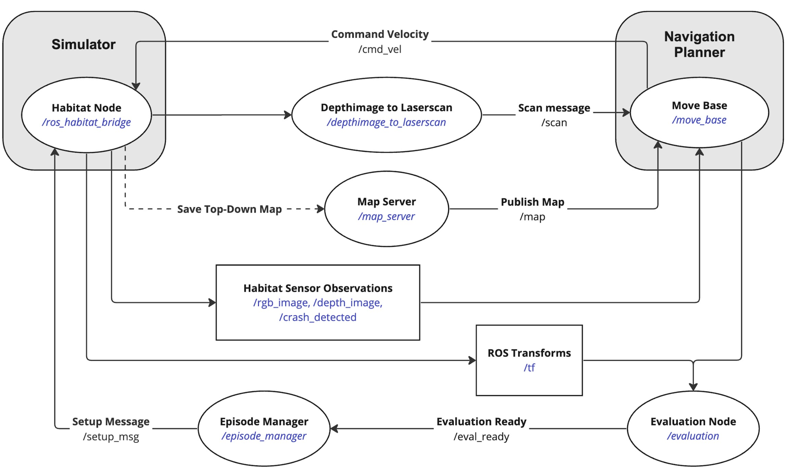

# HabitatROSIntegration
Integration of Habitat's 3D simulation with ROS for efficient robot control and real-time sensor data extraction, addressing the challenges of real-world robotic navigation evaluations.
# Habitat-ROS Integration: Robot Navigation in Photorealistic 3D Environments

This repository is dedicated to the integration of Habitat with ROS (Robot Operating System). With this tool, users can control a robot within a photorealistic 3D scene in Habitat using ROS, specifically through a `cmd_vel`. As the robot moves within the Habitat environment, Habitat provides the sensor data and transformations back to ROS. 

Additionally, this tool provides an evaluation stack, which facilitates the comparison of various navigation algorithms through navigation episodes. A test episode in a sample scene is provided, but users have the flexibility to extend with more episodes and scenes.



## Installation & Setup

### Prerequisites:
1. Install ROS Noetic: [ROS Noetic Installation Guide](http://wiki.ros.org/noetic/Installation)
2. Install the newest version of Habitat Lab: [Habitat Lab's official documentation](https://github.com/facebookresearch/habitat-lab).
3. Ensure the HM3D datasets are downloaded.

### Repository Setup:
1. Navigate to your `catkin_ws and clone the main repository:
    ```bash
    cd path_to_catkin_ws
    git clone https://github.com/taschaub/HabitatROSIntegration.git
    ```
2. Clone the additional repository, then build:
    ```bash
    git clone https://github.com/taschaub/my_robot_navigation.git
    catkin_make
    ```

## Usage

1. To test the Habitat-ROS integration:
    ```bash
    rosrun habitat_ros_integration main
    ```

2. For manual robot control, install the `teleop_twist_keyboard` ROS package:
    ```bash
    rosrun teleop_twist_keyboard teleop_twist_keyboard.py
    ```
   Once this is done, you can manually control the robot and visualize its movements using RViz.

3. For evaluation:
   - First, set your desired `move_base` algorithm in `scripts/maplauncher.py`.
   - Start the `main.py`:
     ```bash
     rosrun habitat_ros_integration main
     ```
   - Run the following commands in order:
     ```bash
     rosrun my_robot_navigation depthimage_to_laserscan
     rosrun habitat_ros_integration maplauncher
     rosrun habitat_ros_integration Evaluation
     ```
   - To specify a custom episode JSON, modify `episodemanager.py`. If no custom JSON is provided, the default will be used:
     ```bash
     rosrun habitat_ros_integration EpisodeManager
     ```
   - Once all episodes are executed, results will be generated as CSV files in the folder `evaluation/episodename`.

